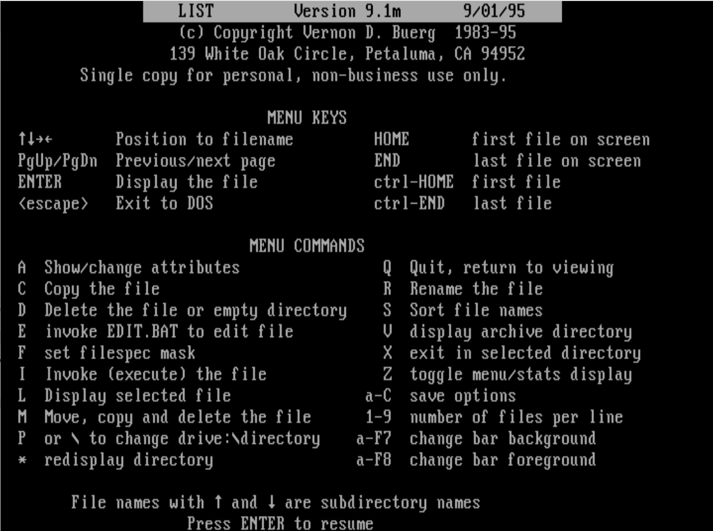

# LIST - Vernon D. Buerg

list, a DOS text file browser by Vernon D. Buerg. V9,1 can be downloaded at:

[https://vetusware.com/manufacturer/Vernon%20D.%20Buerg/?author=5435](https://vetusware.com/manufacturer/Vernon%20D.%20Buerg/?author=5435)

[https://vetusware.com/download/LIST%209.1/?id=12353](https://vetusware.com/download/LIST%209.1/?id=12353)

后来有人出了个 ZBLIST，相当于 LIST 的 32/64bit 版本：<http://www.bizer.com/zblist/>。


```
LIST         Version 7.5f      10/26/90    
		    (c) Copyright Vernon D. Buerg  1983-90 
		    For personal use only. May not be sold.


```


## Why?

I create this repos to save the memories when I was young.


## In memory of Vernon "Vern" D. Buerg

<https://www.dwwatkins.com/in-memory-of-vern-buerg.htm>


<https://groups.google.com/forum/#!topic/alt.comp.freeware/FW7emkKjisA>

<https://www.petaluma360.com/csp/mediapool/sites/PressDemocrat/News/story.csp?cid=2231939&sid=555&fid=181>


<https://hercules-390.yahoogroups.narkive.com/AVmiEDUI/list-vern-buerg-is-dead-and-zblist>


## Screens





## Known Covers

 [Malvineous/linuxlist: Open source clone of the DOS file viewer, List](https://github.com/Malvineous/linuxlist) 


## LICENSE

All sources and bianries are licensed and owned by their owners.

This repository and the introductioin pages are licensed under MIT, by hedzr.

Sincerely.
